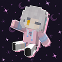
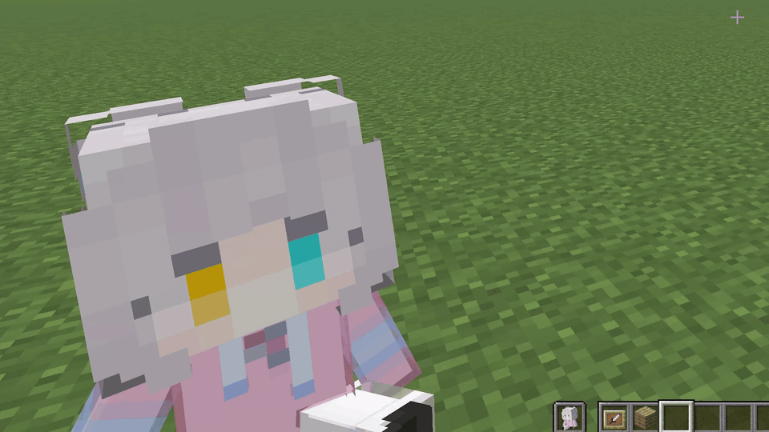
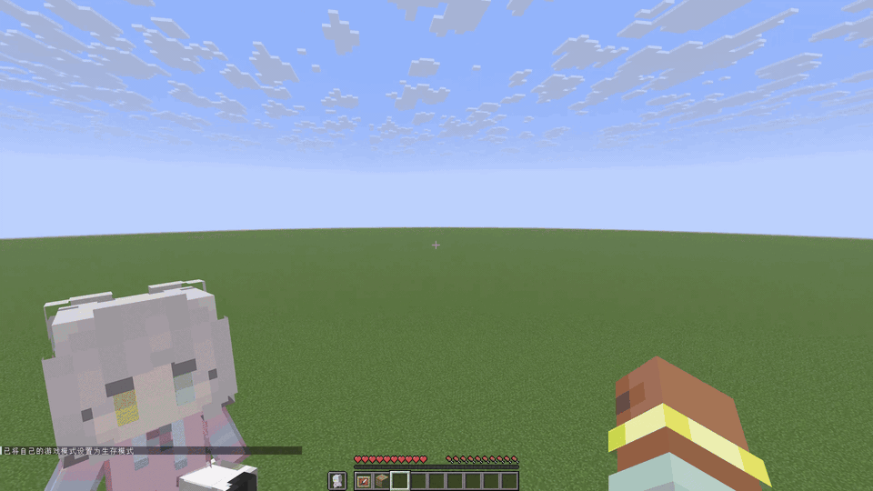
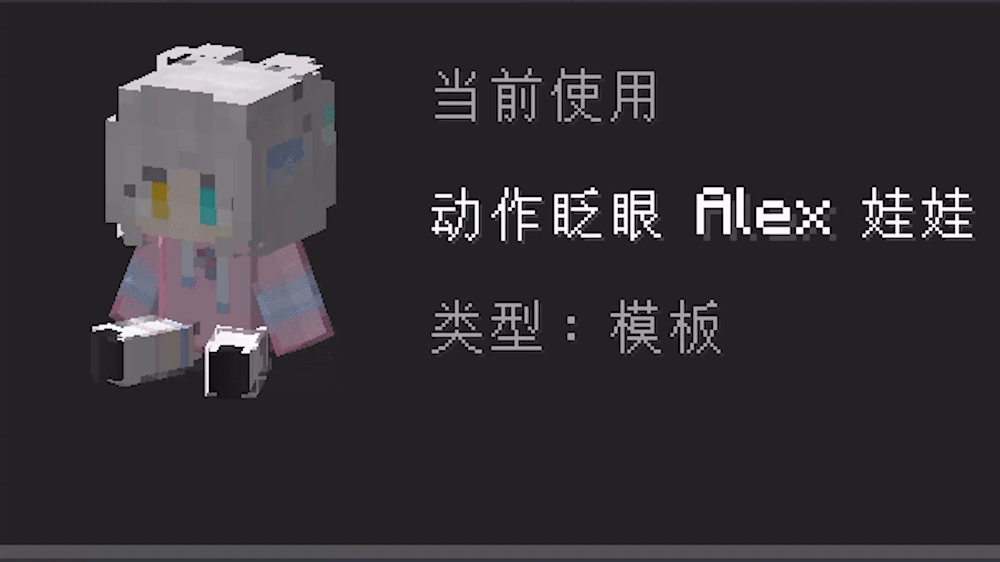

  
  <h1>Totem Doll</h1>
  

    Totem Doll 是一个基于我以前制作的<a href="https://www.bilibili.com/video/BV1Zw411S7DS/">图腾娃娃材质包</a>开发的客户端 Minecraft 模组，
    可以将不死图腾替换为可自定义的 Minecraft 风格娃娃和动态模型。
  

[English](README.md) | [中文](README_CN.md)

## 简介

Totem Doll 可以将不死图腾的外观替换为可选择的 Minecraft 风格娃娃和其他自定义模型。模组支持内置样式、自定义皮肤、动态纹理和骨骼动作，同时不会改变不死图腾原本的保命效果。

### 手持待机动作

娃娃在玩家手中时会播放待机动作。

### 不死图腾激活动作

玩家触发不死图腾时，娃娃会播放专属激活动作。

### 配置界面动作

部分样式会在按下 F9 打开配置界面时播放动作。

## 功能

- 内置 Alex、Steve 和其他 Minecraft 风格娃娃模板
- 支持动态纹理，例如眨眼
- 支持骨骼模型和动作
- 支持第一人称、第三人称、物品栏、掉落物和展示框渲染
- 支持自定义玩家皮肤和本地保存的个人样式
- 支持导入 ZIP 样式包
- 纯客户端模组，服务端不需要安装 Totem Doll
- 保留不死图腾原本的保命效果

## 使用方法

1. 安装与你的 Minecraft 版本对应的 Fabric 或 NeoForge 模组。
2. 进入游戏后按下 `F9` 打开 Totem Doll 配置界面。
3. 选择内置模板或个人样式。
4. 点击“使用”立即应用选中的样式。

创建个人样式时，选择支持自定义皮肤的模板，导入标准的 64×64 Minecraft 皮肤 PNG，输入名称并保存。个人样式会保存在本地，重启游戏后仍然可用。

导入样式包时，在配置界面中选择“导入样式包”，然后选择 ZIP 文件。导入的样式可以直接使用，也可以作为模板继续创建个人样式。

## 兼容性

| 平台 | 支持版本 |
| --- | --- |
| Fabric | Minecraft 1.21–1.21.11 |
| NeoForge | Minecraft 1.21–1.21.11 |

## 文档

- [English documentation](docs/en/README.md)
- [中文文档](docs/zh/README.md)
- [样式包模板](style-template/README.md)
